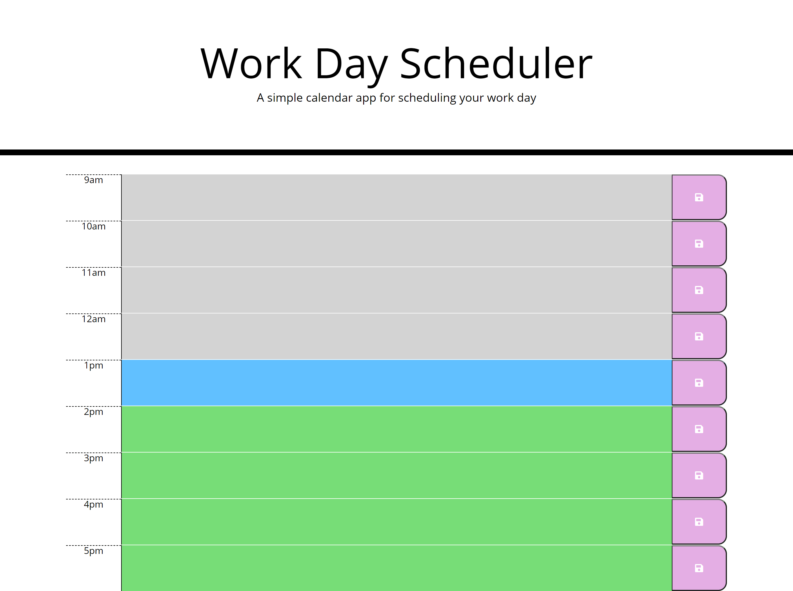

# Work-Day-Scheduler
## Purpose
With modern life-style, an individual often face with a lot of task, either at work or home. Sometimes it can be daunting to keep track all of daily tasks. That is the reason Work-Day-Scheduler was built. This application is helpful tool to tackle a busy day at work. It has a schedule of a typical work day (9am-5pm). Using moment.js, Work-Day-Scheduler displays the past, current, and future time. So one can easily manage what has been done and what is going for the rest of the day. 

## Tech
Work-Day-Scheduler is built with:
* HTML
* CSS
* JQuery
* moment.js
## Website
Work-Day-Scheduler can be found online at  https://sarah-nguyen1993.github.io/Work-Day-Scheduler/

